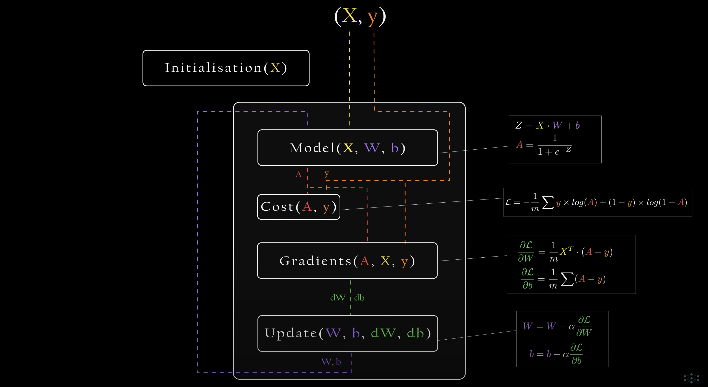
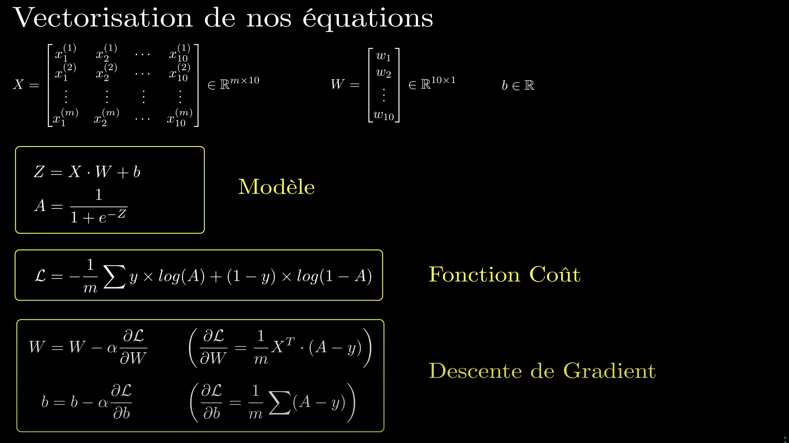
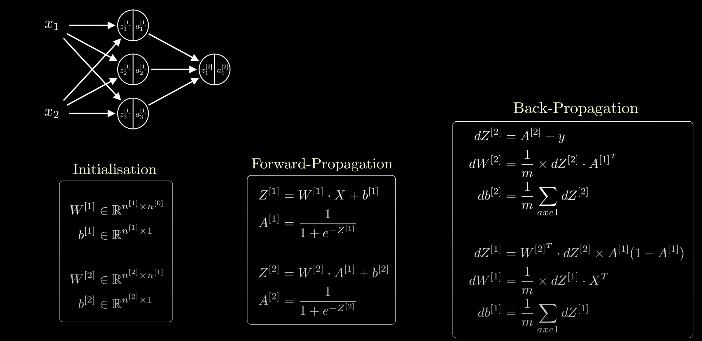

# Key Concepts

### Perceptron:

Simplest form of a neuron

> Takes in a weighted (w) sum (x) + a bias (b) as a input and returns output Z **(linear function)**.

#### Simply put, multiple perceptron linked together form a Neural Network

### Activation function

Last layer gives you the probability of an output z from linear function being correct.

### Sigmoid Function (activation function)

The sigmoid function gives the probability that the input belongs to the positive class often represented as 1.

> It maps any input z to a value between 0 and 1, interpreting it as the probability that the output is 1.
>
> The closer we are to 0.5, the model is uncertain of which class (0 or 1) the input z belongs to.

### So a Neuron is an ouput Z and a probability of Z being correct

### Cost Function (also called Loss Function)

A cost function is the difference between the model's output when it has real data as a input vs the actual output of the real data.

> Multiply the probability of each output being correct (activation function) together **->** converges to 0 therefore we use logarithmic function.
>
> Log of all these will not give the same result, but it will keep the same order as the logarithmic function is **monotonically increasing**.
>
> Log Loss function

## Gradient Descent

MLE (Maximal Likelihood Estimation) is not a single function.

> We need to take our linear function and adjust our **W** parameters and our bias (b) until we minimise our errors (until it is the most likely)(Log Loss)
>
> We need to determine how adjusting our W parameters affect our likelihood which is why we need the **Gradient**.

**The Gradient is the derivative of the Cost function**  
The function must be convex, meaning that we dont have local minimums with respect to all tunable parameters.

> The derivative of the loss with respect to W (weights),  
> The derivative of the loss with respect to b (bias).

### Important

In order to maximize a function f(x), you compute df/dx and make x += df/dx

> **This is always true; when you add a variable's derivative to it, you always make the output function's value bigger**
>
> **In contrast, when you substract a variable's derivative to it, you always make the output function's value smaller, hence you minimise the function**

Note : You multiply the derivative by a learning rate to avoid substracting from X a big value so that you don't diverge.

## Normalisation of data

Put all the variables of the data on the same scale so that bigger values dont outweight smaller ones.  
If x2 is bigger than x1 in the linear function, then adjusting the weight of x1 will have a lesser impact than adjusting the wieght of x2.

> In order to have a good convergence in the Gradient descent function, we want a cost function that evolves similarly on all the weights.

## Overfitting

Overfitting happens when a model learns the details and noise of the training data too well, making it perform poorly on new, unseen data.  
Which can result in the **curse of dimensionality**.

### Curse of dimensionality

When the amount of variables increases, the volume of the space grows exponentially, meaning data points become spread out apart and are often too far apart to form meaningful relationships.

> This sparsity makes it difficult for models to generalize effectively, as they struggle to identify patterns within the vast, mostly empty space. This can lead to overfitting, where the model "over-adapts" to the few data points it has seen, rather than finding generalizable insights.

# Neural Networks

A neural network (NN) is one or multiple layers of neurons where each neuron in a layer receives the same inputs but applies its own unique weight to them.

Only the first layer directly takes in the original input features X. Each subsequent layer then takes the activations (outputs) from the previous layer as its input.

### Forward propagation

# Vectorisation and Matrix

## X (Input Matrix)

> X is the matrix storing all the different variables of the data set  
> **(m x n)** Matrix where m is the number of data set and n the number of variables
>
> There will be a different matrix for each layers

## Y (Real data output Matrix)

> Y is the matrix storing all the outputs for each row of X (it is the output of the real data)  
> **(m x 1)** Matrix where m is the number of data set

## W (Weight Matrix)

> W is the Matrix storing all the weights of the NN  
> **(n x k)** Matrix where n is the amount of input features (variables) from x and k is the number of neurons in the layer

Each element
𝑊
[
𝑖
,
𝑗
]
represents the weight for feature
𝑖
going to neuron
𝑗

## b (bias)

> b is the bias matrix  
> **(1 x K)** where k is the amount of neurons

Each bias element
𝑏
𝑗 (where
𝑗
is the neuron index) is added to the input sum before applying the activation function for neuron
𝑗

## Z (Output Matrix)

> Zmatrix stores the raw output of the linear combination of inputs, weights, and bias before applying the activation function.  
> **(m x k)** Matrix where m is the number of data set and k the number of neurons in the layer

## A (Activation Matrix)

> A is the matrix storing all the activation output of the neurons for each data set  
> **(m x k)** Matrix where m is the number of data set and k the number of neurons in the layer

Each element
𝐴
[
𝑖
,
𝑗
]
represents the activation output (after applying the activation function) of neuron
𝑗
for sample
𝑖
.

## dW (derivative of the Loss function in respect to weight)

> dW is a matrix storing all the gradient of the loss function with respect to the weights of the neurons
> **(m x k)** Matrix where m is the number of variable x and k the amount of neurons (same size as W, same concept)

## db (derivative of the Loss function in respect to bias)

> db is a vector storing all the gradient of the loss function with respect to the bias of the neurons
> **(k x 1)** where k is the amount of neurons

# Logic of the code

# Important definitons of functions I will be using

## With a single neuron:

## With a single layer and n neurons

