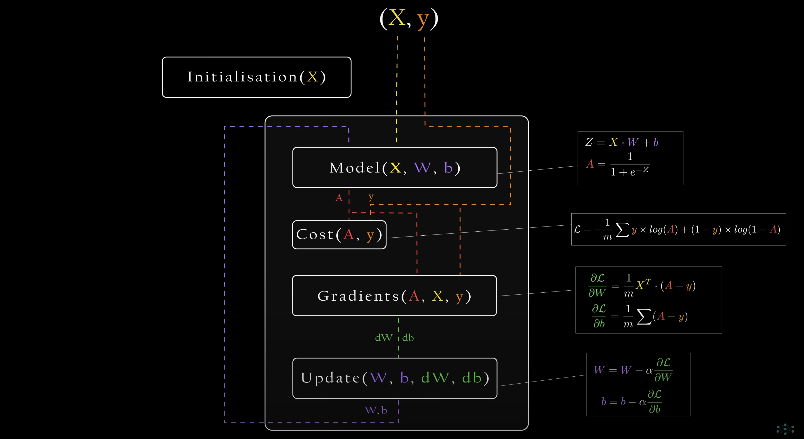
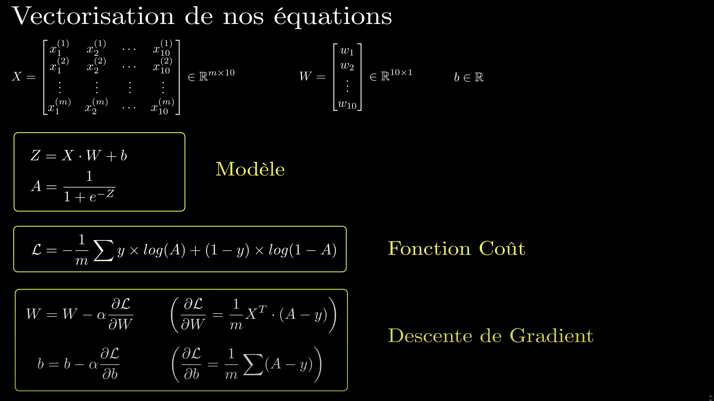

# Key Concepts

### Perceptron:

> Simplest form of a neuron  
> Takes in a weighted (w) sum (x) + a bias (b) as a input and returns output Z **(linear function)**
>
> #### Simply put, multiple perceptron linked together form a Neural Network

### Activation function

> Gives you the probability of an output z from linear function being correct

### Sigmoid Function (activation function)

> The sigmoid function gives the probability that the input belongs to the positive class often represented as 1.  
> It maps any input z to a value between 0 and 1, interpreting it as the probability that the output is 1.  
> The closer we are to 0.5, the model is uncertain of which class (0 or 1) the input z belongs to

## So a Neuron is an ouput Z and a probability of Z being correct

### Cost Function

> A cost function is the difference between the model's output when it has real data as a input vs the actual output of the real data  
> Multiply the probability of each output being correct (activation function) together **->** converges to 0 therefore we use logarithmic function  
> Log of all these will not give the same result, but it will keep the same order as the logarithmic function is **monotonically increasing**.
> Log Loss function

### Gradient Descent

> MLE (Maximal Likelihood Estimation) is not a single function.  
> We need to take our linear function and adjust our **W** parameters and our bias (b) until we minimise our errors (until it is the most likely)(Log Loss)
> We need to determine how adjusting our W parameters affect our likelihood which is why we need the **Gradient**  
> **The Gradient is the derivative of the Cost function**  
> The function must be convex, meaning that we dont have local minimums  
>  The derivative of the loss with respect to W (weights),  
> The derivative of the loss with respect to b (bias).

# Vectorisation and Matrix

## X (Input Matrix)

> X is the matrix storing all the different variables of the data set  
> **(m x n)** Matrix where m is the number of data set and n the number of variables

## Y (Real data output Matrix)

> Y is the matrix storing all the outputs for each row of X (it is the output of the real data)  
> **(m x 1)** Matrix where m is the number of data set

## W (Weight Matrix)

> W is the Matrix storing all the weights of the NN  
> **(n x k)** Vector where n is the amount of input features (variables) from x and k is the number of neurons in the layer

## b (bias)

> b is the bias vector  
> **(k x 1)** where k is the amount of neurons

## Z (Output Matrix)

> Zmatrix stores the raw output of the linear combination of inputs, weights, and bias before applying the activation function.  
> **(m x k)** Matrix where m is the number of data set and k the number of neurons in the layer

## A (Activation Matrix)

> A is the matrix storing all the activation output of the neurons for each data set  
> **(m x k)** Matrix where m is the number of data set and k the number of neurons in the layer

## dW (derivative of the Loss function in respect to weight)

> dW is a matrix storing all the gradient of the loss function with respect to the weights of the neurons
> **(m x k)** Matrix where m is the number of variable x and k the amount of neurons (same size as W, same concept)

## db (derivative of the Loss function in respect to bias)

> db is a vector storing all the gradient of the loss function with respect to the bias of the neurons
> **(k x 1)** where k is the amount of neurons

# Logic of the code

# Important definitons of functions I will be using

